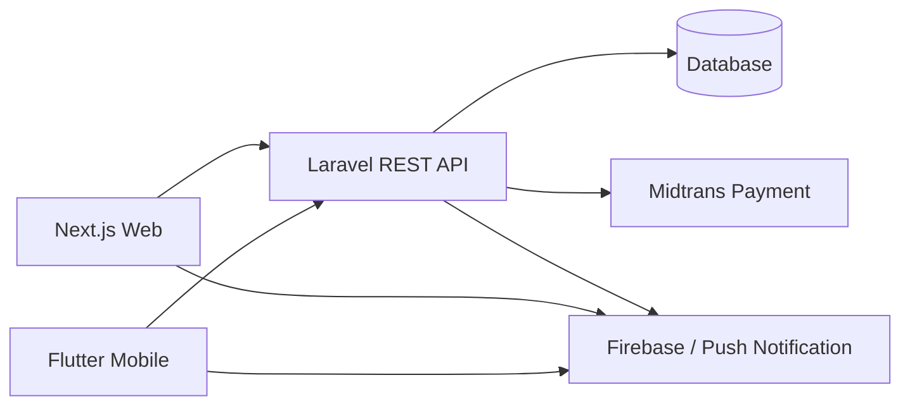

<div align="center">
  <h1>Jualin</h1>
  <p><strong>Marketplace multi-platform untuk jual beli produk dengan web, mobile, chat, pembayaran, dompet, dan backoffice admin.</strong></p>

  <p>
    
    
    
    
  </p>
</div>

---

## Dashboard

<table>
  <tr>
    <td width="50%" valign="top">
      <h3>Marketplace Experience</h3>
      <p>Jualin menghubungkan customer dan seller dalam satu alur marketplace: cari produk, lihat detail, chat penjual, checkout, pembayaran, dan pantau transaksi.</p>
      <p>
        
        
        
      </p>
    </td>
    <td width="50%" valign="top">
      <h3>Application Modules</h3>
      <p><strong>Web App</strong></p>
      <p>
        
        
      </p>
      <p><strong>Mobile App</strong></p>
      <p>
        
        
      </p>
      <p><strong>Backend API</strong></p>
      <p>
        
        
      </p>
    </td>
  </tr>
  <tr>
    <td width="50%" valign="top">
      <h3>Core Features</h3>
      <table>
        <tr>
          <td><strong>Product Discovery</strong><br>Daftar produk, kategori, detail produk, stok, kondisi, dan gambar produk.</td>
        </tr>
        <tr>
          <td><strong>Chat Marketplace</strong><br>Room chat customer-seller, preview produk, kirim teks, dan kirim gambar produk.</td>
        </tr>
        <tr>
          <td><strong>Checkout and Payment</strong><br>Checkout, wallet, Midtrans, escrow/COD, refund, dan riwayat transaksi.</td>
        </tr>
      </table>
    </td>
    <td width="50%" valign="top">
      <h3>Admin and Demo Flow</h3>
      <table>
        <tr>
          <td><strong>Backoffice Admin</strong><br>Kelola user, produk, laporan, transaksi, dan monitoring marketplace.</td>
        </tr>
        <tr>
          <td><strong>Seller Verification</strong><br>Badge seller aktif setelah mencapai target transaksi valid.</td>
        </tr>
        <tr>
          <td><strong>Presentation Seeder</strong><br>Data demo bisa dikembalikan dengan migrate fresh dan seed ulang.</td>
        </tr>
      </table>
    </td>
  </tr>
</table>

---

## Tentang Project

Jualin adalah aplikasi marketplace dengan tiga peran utama: **customer**, **seller**, dan **admin**. Project ini dibangun sebagai satu ekosistem berisi REST API, aplikasi web, dan aplikasi mobile.

Fokus utama Jualin adalah pengalaman jual beli yang aman dan praktis: pengguna dapat mencari produk, membuka detail produk, chat dengan penjual, melakukan checkout, menggunakan wallet, memantau transaksi, melaporkan produk/pengguna, dan mengelola data melalui backoffice.

## Fitur Utama

| Area | Fitur |
| --- | --- |
| Customer | Browse produk, detail produk, chat penjual, checkout, riwayat pembelian, refund/COD flow |
| Seller | Kelola produk, pesanan, klaim escrow, statistik penjualan, verifikasi seller |
| Admin | Backoffice user, produk, laporan, transaksi, dan monitoring |
| Chat | Room chat, preview produk, kirim pesan, kirim gambar, notifikasi |
| Pembayaran | Wallet, Midtrans, escrow/COD, riwayat pembayaran |
| Mobile | Flutter app untuk customer dan seller flow |

## Struktur Aplikasi

```text
JUALIN-ABP/
|-- jualin-api/   # Laravel REST API dan business logic
|-- jualin/       # Next.js web app
|-- mobile_app/   # Flutter mobile app
```

## Arsitektur Singkat



## Tech Stack

| Layer | Teknologi |
| --- | --- |
| Backend | PHP 8.2+, Laravel 12, Eloquent, JWT Auth, Sanctum, PHPUnit |
| Web | Next.js 16, React 19, Tailwind CSS 4, Axios, Firebase Web SDK |
| Mobile | Flutter, Dart, Shared Preferences, Firebase Messaging, Image Picker |
| Integrasi | Midtrans, Firebase, Resend/SMTP |
| Database | SQLite untuk lokal, mendukung MySQL/MariaDB/PostgreSQL/SQL Server |

## Quick Start

Clone repository:

```bash
git clone https://github.com/rkhplace/JUALIN-ABP.git
cd JUALIN-ABP
```

> Root repository hanya menjadi container multi-app. Jalankan setup dari folder aplikasi masing-masing.

## Backend API

Masuk ke folder backend:

```bash
cd jualin-api
composer install
npm install
```

Buat file `.env`, lalu isi konfigurasi minimal:

```env
APP_NAME=Jualin
APP_ENV=local
APP_KEY=
APP_DEBUG=true
APP_URL=http://localhost:8000
FRONTEND_URL=http://localhost:3000

DB_CONNECTION=sqlite

CACHE_STORE=database
SESSION_DRIVER=database
QUEUE_CONNECTION=database
FILESYSTEM_DISK=public

JWT_SECRET=
JWT_TTL=1440
JWT_REFRESH_TTL=20160

MIDTRANS_SERVER_KEY=
MIDTRANS_CLIENT_KEY=
MIDTRANS_IS_PRODUCTION=false
MIDTRANS_IS_SANITIZED=true
MIDTRANS_IS_3DS=true
```

Setup database dan key:

```bash
php -r "file_exists('database/database.sqlite') || touch('database/database.sqlite');"
php artisan key:generate
php artisan jwt:secret
php artisan migrate --seed
php artisan storage:link
```

Jalankan API:

```bash
php artisan serve --host=127.0.0.1 --port=8000
```

API tersedia di:

```text
http://localhost:8000/api/v1
```

## Frontend Web

Masuk ke folder web:

```bash
cd jualin
npm install
```

Buat `.env.local`:

```env
NEXT_PUBLIC_API_URL=http://localhost:8000
NEXT_PUBLIC_MIDTRANS_CLIENT_KEY=

NEXT_PUBLIC_FIREBASE_API_KEY=
NEXT_PUBLIC_FIREBASE_AUTH_DOMAIN=
NEXT_PUBLIC_FIREBASE_PROJECT_ID=
NEXT_PUBLIC_FIREBASE_STORAGE_BUCKET=
NEXT_PUBLIC_FIREBASE_MESSAGING_SENDER_ID=
NEXT_PUBLIC_FIREBASE_APP_ID=
NEXT_PUBLIC_FIREBASE_MEASUREMENT_ID=
```

Jalankan web:

```bash
npm run dev
```

Buka:

```text
http://localhost:3000
```

Build production:

```bash
npm run build
npm run start
```

## Mobile App

Masuk ke folder mobile:

```bash
cd mobile_app
flutter pub get
flutter doctor
flutter devices
```

Jalankan di Android emulator:

```bash
flutter run --dart-define=API_BASE_URL=http://10.0.2.2:8000/api/v1
```

Jalankan di perangkat fisik:

```bash
flutter run --dart-define=API_BASE_URL=http://192.168.1.10:8000/api/v1
```

Ganti `192.168.1.10` dengan IP komputer yang menjalankan backend.

Build APK release:

```bash
flutter build apk --release
```

Output:

```text
mobile_app/build/app/outputs/flutter-apk/app-release.apk
```

## Testing

Backend:

```bash
cd jualin-api
php artisan test
```

Web:

```bash
cd jualin
npm test -- --runInBand
```

Mobile:

```bash
cd mobile_app
flutter analyze
flutter test
```

## Deployment Notes

### Railway Backend

Jalankan migration production:

```bash
php artisan migrate --force
```

Reset data demo untuk presentasi:

```bash
php artisan migrate:fresh --seed --force
php artisan cache:clear
php artisan config:clear
php artisan route:clear
```

### Web

Pastikan environment variable berikut mengarah ke backend production:

```env
NEXT_PUBLIC_API_URL=https://your-api-domain.com
```

## Seeder Demo

Seeder utama dijalankan dari:

```text
jualin-api/database/seeders/DatabaseSeeder.php
```

Seeder mencakup data user, produk, transaksi, pembayaran, laporan, chat, dan forum demo. Untuk mengembalikan data presentasi:

```bash
cd jualin-api
php artisan migrate:fresh --seed
```

## Perintah Berguna

```bash
# Backend
php artisan optimize:clear
php artisan route:list
php artisan queue:listen --tries=1

# Web
npm run build
npm run dev

# Mobile
flutter clean
flutter pub get
flutter analyze
flutter build apk --release
```

## Catatan Keamanan

Jangan commit file berikut:

```text
.env
.env.local
google-services.json
firebase-credentials.json
service-account.json
```

Gunakan environment variable Railway/Vercel/Firebase untuk credential production.

## Tim

Project ini dikembangkan untuk kebutuhan pembelajaran dan presentasi aplikasi marketplace multi-platform.

---

<div align="center">
  <strong>Jualin</strong><br>
  Marketplace web dan mobile untuk transaksi yang lebih aman, rapi, dan mudah dipresentasikan.
</div>
